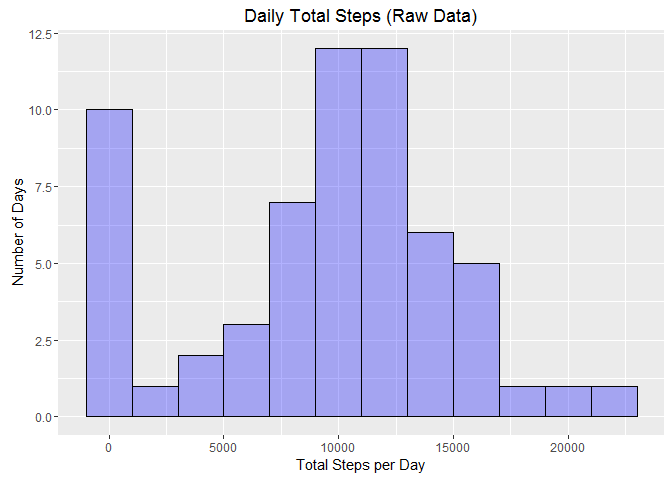
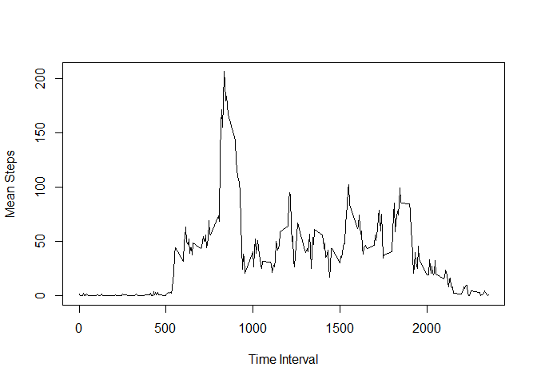
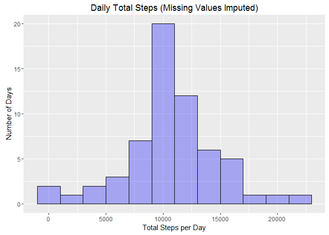
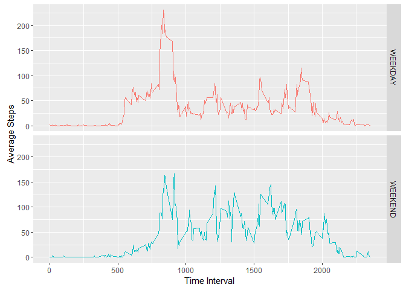

# Reproducible Research: Peer Assessment 1
D. Spence  


## Loading and preprocessing the data
First, we load essential libraries for the task, dplyr and ggplot2. (Thank you, Hadley Wickham, you are my hero.) Next we read in the data file.

```r
library(dplyr)
```

```
## 
## Attaching package: 'dplyr'
## 
## The following objects are masked from 'package:stats':
## 
##     filter, lag
## 
## The following objects are masked from 'package:base':
## 
##     intersect, setdiff, setequal, union
```

```r
library(ggplot2)
df_act <- read.csv("activity.csv")
```


## What is mean total number of steps taken per day?
####Instructions:  
**1. Make a histogram of the total number of steps taken each day**

```r
#Summarize by date to compute total steps per day
date_summary <- group_by(df_act,date) %>% summarise(., total=sum(steps,na.rm=TRUE))

#Create histogram for total steps per day
gtotal <- ggplot(date_summary,aes(date_summary$total))
gtotal <- gtotal + geom_histogram(binwidth=2000,col="black",fill="blue",alpha=.3)
gtotal <- gtotal + labs(x="Total Steps per Day",y="Number of Days")
gtotal <- gtotal + labs(title="Daily Total Steps (Raw Data)")
gtotal
```

 

**2. Calculate and report the mean and median total number of steps taken per day**

```r
#Compute mean and median steps per day
#I'm storing these results so they can be reported in-line below.
smean <- mean(date_summary$total)
smed <- median(date_summary$total)
```

The mean number of steps per day is 9354.2295082 and the median is 10395 steps per day.


## What is the average daily activity pattern?
####Instructions:  
**1. Make a time series plot of the 5-minute interval (x-axis) and the average number of steps taken, averaged across all days (y-axis)**

```r
#Group by interval and compute mean steps for each interval
int_summary <- group_by(df_act,interval) %>% summarise(.,avg=mean(steps,na.rm=TRUE))

#Use resulting dataframe to generate line plot of averages by time interval
plot(int_summary$avg~int_summary$interval,type="l",xlab="Time Interval", ylab="Mean Steps")
```

 

**2. Which 5-minute interval, on average across all the days in the dataset, contains the maximum number of steps?**

```r
#A couple of ways to find time interval with highest average steps
#If all goes as planned, the following two results should match

#First, set up filter to pull interval with max average
int_summary$interval[int_summary$avg==max(int_summary$avg)]
```

```
## [1] 835
```

```r
#Second, order rows from smallest average to largest, and take last interval
last(arrange(int_summary,avg)$interval)
```

```
## [1] 835
```

Thank goodness, both techniques yield the same result. Interval 835 has the greatest average number of steps per day. This is consistent with the time series plot.

## Imputing missing values
####Instructions:  
**1. Calculate and report the total number of missing values in the dataset (i.e. the total number of rows with NAs)**

```r
#Count number of rows with missing data (NA)
count(df_act, is.na(steps))
```

```
## Source: local data frame [2 x 2]
## 
##   is.na(steps)     n
##          (lgl) (int)
## 1        FALSE 15264
## 2         TRUE  2304
```

The table above shows both the number of rows with NA (TRUE) and the number without (FALSE).

**2. Devise a strategy for filling in all of the missing values in the dataset. The strategy does not need to be sophisticated.**  
**3. Create a new dataset that is equal to the original dataset but with the missing data filled in.**


Steps 2 & 3 are performed together below. When number of steps is missing for a given row, we find the mean number of steps from other rows with the same interval and use that average as an estimate of the missing value.

```r
#Copy dataframe and fill in NA values with mean of corresponding interval
df_act_fill <- df_act

len <- length(df_act[,1])
for (idx in 1:len)
{
    #if this row has NA, find corresponding interval and use its mean steps
    if(is.na(df_act$steps[idx]))
    {
        rowfilter <- int_summary$interval == df_act$interval[idx]
        df_act_fill$steps[idx] <- int_summary$avg[rowfilter]
    }
}

count(df_act_fill, is.na(steps))
```

```
## Source: local data frame [1 x 2]
## 
##   is.na(steps)     n
##          (lgl) (int)
## 1        FALSE 17568
```

Just to prove that we got rid of the NA's, we count them again when we're done filling in missing values, and we show that no NA's remain.

**4. Make a histogram of the total number of steps taken each day and Calculate and report the mean and median total number of steps taken per day. Do these values differ from the estimates from the first part of the assignment? What is the impact of imputing missing data on the estimates of the total daily number of steps?**

```r
#Summarize by date to compute revised steps per day
date_summary <- group_by(df_act_fill,date) %>% summarise(., total=sum(steps,na.rm=TRUE))

#create histogram for revised total steps per day
ftotal <- ggplot(date_summary,aes(date_summary$total))
ftotal <- ftotal + geom_histogram(binwidth=2000,col="black",fill="blue",alpha=.3)
ftotal <- ftotal + labs(x="Total Steps per Day",y="Number of Days")
ftotal <- ftotal + labs(title="Daily Total Steps (Missing Values Imputed)")
ftotal
```

 

```r
#compute new estimates for mean and median steps per day
mean(date_summary$total)
```

```
## [1] 10766.19
```

```r
median(date_summary$total)
```

```
## [1] 10766.19
```

Both the histogram and the new mean and median estimates have changed as a result of estimating and assigning the missing values. The spike around zero is no longer apparent in the histogram (when values were missing for most or all of an entire day, the day had zero or very low values for the total steps.) Likewise, the mean and median steps per day also increased, as would be expected. The mean and median now have the same value after we used this particular scheme to estimate the missing values; this is a reflection of how much more symmetric the distribution is, which can also be seen in the histogram. 

## Are there differences in activity patterns between weekdays and weekends?
####Instructions:  
**1. Create a new factor variable in the dataset with two levels -- "weekday" and "weekend" indicating whether a given date is a weekday or weekend day.**


```r
#Use function to distinguish weekend from week days
is_weekend <- function(day)
{
    if (day == "Saturday" | day == "Sunday")
        daytype = "WEEKEND"
    else
        daytype = "WEEKDAY"
    
    daytype
}

#Add a column in data frame to identify weekday vs. weekend
len <- length(df_act_fill[,1])
day_type <- vector()
for (idx in 1:len)
    day_type[idx] <- is_weekend(weekdays(as.Date(df_act_fill$date[idx])))

df_act_fill$daytype <- as.factor(day_type)
```

**2. Make a panel plot containing a time series plot of the 5-minute interval (x-axis) and the average number of steps taken, averaged across all weekday days or weekend days (y-axis).**

```r
#Summarize average number of steps for each time interval, by weekday/weekend
w_summary <- group_by(df_act_fill,daytype,interval) %>% summarise(.,avg=mean(steps))

#Create panel plot to show time series average by weekday/weekend
wplot <- ggplot(w_summary,aes(x=interval,y=avg))
wplot <- wplot + geom_line(aes(color=daytype))
wplot <- wplot + facet_grid(daytype ~ .)
wplot <- wplot + labs(x="Time Interval") + labs(y="Average Steps")
wplot <- wplot + theme(legend.position="none")
wplot
```

 

On weekdays, there is a more obvious spike (above 200) early in the day, followed by a more sedentary pattern for the remainder of the day, in which the user rarely reaches 100 steps in a given 5-minute interval. On weekends, there is no interval with an average above 200 steps, and the initial spike is not as markedly different from the rest of the day: the user appears to be slightly more active throughout the day, with many more intervals above 100 and even above 150. 
